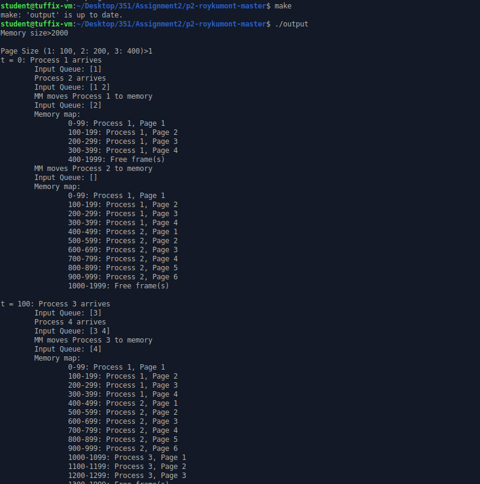

# CPSC_351_Assignment_2
**_CPSC 351- Section 2(13643) Spring 2019_**

**Group Members:**

	James I Ku
	894841865
	thatoneddrguy@csu.fullerton.edu
    
	Esteban Montelongo
	888847456
	EstebanMontelongo@csu.fullerton.edu
	
	Bony Roy
	898161054
	broy91@csu.fullerton.edu

**Purpose:**
Write a simulation that explores the effects of limited memory and memory management policies.

**Programming Language Used:**	
C++

**File Names:**	

     1. p2-roykumont.tar
     2. in1.txt: Input file name
     3. out1.txt: sample output file for memory block size 100
     4. out2.txt: sample output file for memory block size 200
     5. out3.txt: sample output file for memory block size 400
     6. main.cpp: Main File containing the memory management functionality.
     7. process.h: Header File containing the definition for input file structure.
     8. memblock.h: Header File containing the definition for memory block structure.
     9. Makefile: Makefile to build the main.cpp, process.h and memblock.h
     
**To run our program:**	

    1. Download tar archive.
    2. Extract files from tar archive.
    3. Open terminal in directory where files are located.
    4. In terminal type make and press enter.
    5. Then enter ./output.    
    6. Please keep the input file name as in1.txt(Hardcoded into program).
    7. Enter total memory size and page size(1 for 100, 2 for 200 and 3 for 400).
    8. Output will be generated into terminal window.

**Team Collaboration:**
Our team met up three times at the CSUF library to research the necessary system function calls and collaborate on the code via GitHub.

***Sources**: Professor Yun Tian assignment document posted in Titanium.
